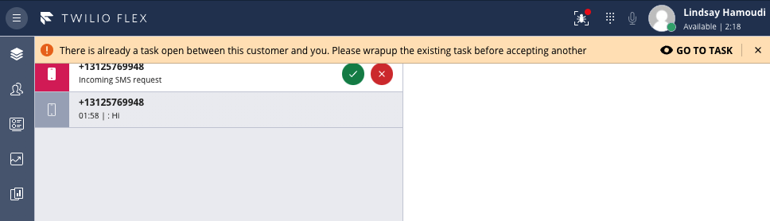

# Alert Agent on Accepting a Second Task for a Chat Channel that they are Already a Member Of

Agents shouldn’t try to handle multiple tasks for the same channel at once. If they do, then when they hit "Complete" on one of those tasks - they will be removed from the channel, thus impacting the other task(s) that share that same chat channel.

If you use long-lived channels, there's the potential for a new task to arrive for a chat channel that's still being wrapped up by your agent. Clicking "End Chat" on a long-lived chat task will only clear the proxy session between Twilio and the customer (but will keep the channel active). Therefore a further message from the customer would lead to a new proxy session and a new task - using the same long-lived chat channel.

This plugin helps to mitigate against the above scenario by showing a notification if trying to accept a task that’s for a chat channel that’s already in use in another task. The "Accept Task" action will be blocked until the agent wraps up other tasks associated with that channel. The notification provides a convenient "Go to Task" link - to quickly jump to the existing task that needs to be wrapped up.



## About Twilio Flex Plugins

Twilio Flex Plugins allow you to customize the appearance and behavior of [Twilio Flex](https://www.twilio.com/flex). If you want to learn more about the capabilities and how to use the API, check out our [Flex documentation](https://www.twilio.com/docs/flex).

## Setup

Make sure you have [Node.js](https://nodejs.org) as well as [`npm`](https://npmjs.com). We support Node >= 10.12 (and recommend the _even_ versions of Node). Afterwards, install the dependencies by running `npm install`:

```bash
cd 

# If you use npm
npm install
```

Next, please install the [Twilio CLI](https://www.twilio.com/docs/twilio-cli/quickstart) by running:

```bash
brew tap twilio/brew && brew install twilio
```

Finally, install the [Flex Plugin extension](https://github.com/twilio-labs/plugin-flex) for the Twilio CLI:

```bash
twilio plugins:install @twilio-labs/plugin-flex
```

## Development

In order to develop locally, you can use the Webpack Dev Server by running (from the root plugin directory):

```bash
twilio flex:plugins:start
```

This will automatically start up the Webpack Dev Server and open the browser for you. Your app will run on `http://localhost:3000`. If you want to change that you can do this by setting the `PORT` environment variable:

When you make changes to your code, the browser window will be automatically refreshed.

## Deploy

When you are ready to deploy your plugin, in your terminal run:
```
Run: 
twilio flex:plugins:deploy --major --changelog "Notes for this version" --description "Functionality of the plugin"
```
For more details on deploying your plugin, refer to the [deploying your plugin guide](https://www.twilio.com/docs/flex/plugins#deploying-your-plugin).


